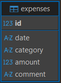

# SpendSense API — Expense Tracker

Backend-сервис для управления личными финансами. Проект разработан с акцентом на архитектуру API и полное покрытие процесса обеспечения качества (Quality Assurance).

## Стек технологий
- **Backend:** Python (FastAPI), Pydantic (Валидация данных)
- **Database:** SQLite
- **Documentation:** Swagger (OpenAPI), Confluence (ведение требований и чек-листов, спецификация API), Jira (Баг-трекинг)
- **Testing Tools:** Postman (JS scripts), Pytest (в процессе), DBeaver

---

## 🗄 Структура базы данных

## Quality Assurance (Тестирование)

В папке `/docs` продемонстрирован пройденный мной цикл тестирования API от анализа требований до автоматизации проверок.

### 1. Документация проекта
Более подробно ознакомиться с проектом можно изучив следующие данные:
* [Требования к системе](docs/requirements.md) — функциональные и нефункциональные требования.
* [Спецификация API](docs/api_spec.md) — подробное описание эндпоинтов, параметров и ответов.

### 2. Тестовая документация
Тестовая документация (изначально велась в Confluence, экспортирована для демонстрации), разработаны артефакты, покрывающие основной функционал (CRUD трат, фильтрация, аналитика):
* [Тест-дизайн](docs/test_design.md) — таблицы решений, граничные значения и классы эквивалентности.
* [Smoke + Sanity Чек-лист](/docs/CHECKLIST.md) - полный жизненный цикл траты.
* [Тест-кейсы](docs/test_cases.md) 

### 2. API Testing (Postman)
В папке `/postman` находится коллекция тестов и переменные окружения.
**Что покрыто тестами:**
* Валидация статус-кодов (200, 201, 204, 404, 422).
* Проверка структуры JSON-ответа (Schema testing).
* Скрипты на JavaScript для проверки бизнес-логики (например, корректность суммы в `/expenses/summary`).
* Цепочки запросов (Chaining): создание -> чтение по ID -> изменение -> чтение -> удаление -> проверка отсутствия.

---

## Как запустить проект

1. Клонировать репозиторий: `git clone https://github.com/MeloHolik/expense-tracker-api.git`
2. Создать и активировать venv: `python -m venv venv`
3. Установить зависимости: `pip install -r requirements.txt`
4. Запустить сервер: `uvicorn app.main:app --reload`
5. Документация будет доступна по адресу: `http://127.0.0.1:8000/docs`

---

## План развития (Roadmap)
- [ ] Добавление ввода поля `date` для каждой траты и валидация ввода (ISO 8601).
- [ ] Покрытие кода Unit-тестами (Pytest).
- [ ] Интеграция Docker(+ `docker-compose`) для контейнеризации приложения.
- [ ] Добавление аутентификации
- [ ] Интеграция Postgres(+ миграции)